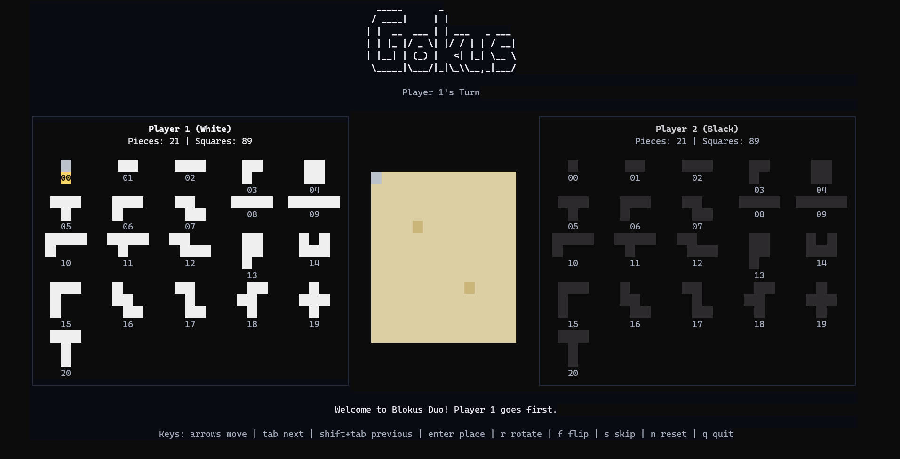

## Gokus

Gokus is a small terminal Blokus Duo game.



### Features
- Blokus Duo board and piece logic
- Turn-based 2-player flow
- Piece rotate and flip
- Ghost preview before placing
- Terminal UI built with Bubble Tea + Lip Gloss
- Design based on this nice paper: [Implementing Minimax Search with Alpha-Beta
Pruning in Blokus Duo](https://informatika.stei.itb.ac.id/~rinaldi.munir/Stmik/2024-2025/Makalah2025/Makalah-IF2211-Strategi-Algoritma-2025%20(99).pdf)

### Todo
- [x] SSH server for remote play
- Detect game over and show winner
- AI opponent?

### Controls

- Arrow keys: move cursor
- Tab / Shift+Tab: next / previous piece
- Enter: place piece
- r: rotate piece
- f: flip piece
- s: skip turn
- n: new game
- q: quit

### Run
```bash
go run ./cmd/gokus
```

Or with Makefile:

```bash
make build
make run
```
